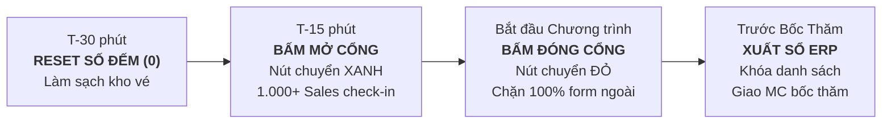
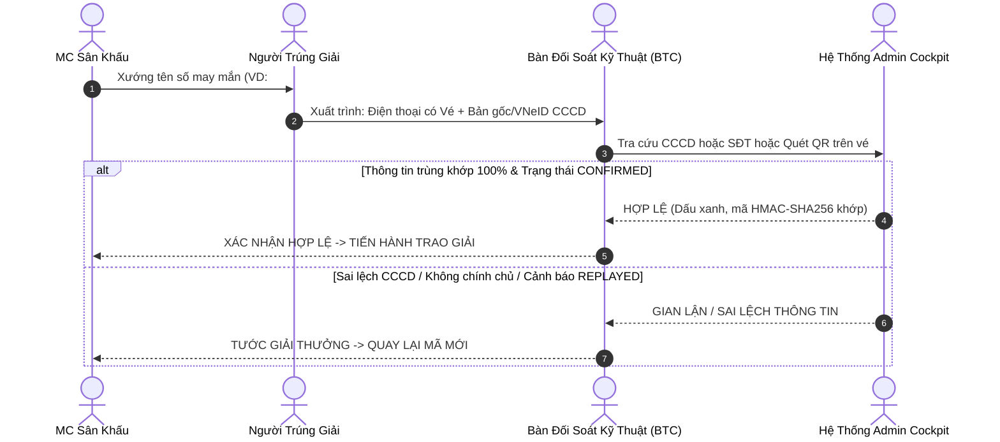

# THE SYNC SHOW — NORTON PARK | GAMUDA LAND
## SLIDE HANDOVER & RUNBOOK KỸ THUẬT VẬN HÀNH TRƯỚC GIỜ G
> **Chủ đầu tư**: Gamuda Land Việt Nam  
> **Đơn vị phát triển & bảo chứng công nghệ**: 1990 Agency  
> **Thời gian sự kiện**: 08:00 – 11:30 | Thứ Năm | Ngày 08.10.2026  
> **Địa điểm**: Rạp Xiếc & Biểu Diễn Đa Năng Phú Thọ (03 Lữ Gia, P. Phú Thọ, Q.11, TP.HCM)  
> **Quy mô**: 1.000 – 1.500 Chiến binh kinh doanh đại lý phân phối  
> **Hệ thống điều hành**: [Landing Page Check-in](https://norton-kickoff-event.vercel.app) | [Admin Cockpit](https://norton-kickoff-event.vercel.app/admin?secret=norton_admin_secret_2026) | [Google Sheet ERP](https://docs.google.com/spreadsheets/d/1IpfahCoOnvE5dc9JES9upMiBvW6l__Cx8X4aD2i3A28/edit)

---

<!-- SLIDE 1: COVER & EXECUTIVE SUMMARY -->
<div align="center">
  <p style="font-family:'SFU Futura', sans-serif; letter-spacing:4px; font-size:12px; color:#A78061; font-weight:700; text-transform:uppercase; margin-bottom:8px;">
    GAMUDA LAND · 1990 AGENCY · TECHNICAL HANDOVER DECK
  </p>
  <h1 style="font-family:'SVN-The Seasons', Georgia, serif; color:#181E19; font-size:32px; margin-top:0; margin-bottom:12px;">
    THE SYNC SHOW — KICK-OFF CHECK-IN &amp; LUCKY DRAW
  </h1>
  <p style="font-family:'SVN-Gotham', sans-serif; font-size:15px; color:#5D614F; max-width:680px; margin:auto; line-height:1.6;">
    Bộ tiêu chuẩn kỹ thuật &amp; quy chế điều hành cổng check-in, cấp số may mắn tức thì $O(1)$ và đối soát minh bạch phòng chống gian lận/tranh chấp pháp lý cho 1.000+ Sales.
  </p>
</div>

<br/>

```
  ┌────────────────────────────────────────────────────────────────────────────────────────┐
  │ 🌿 NORTON PARK BRAND PALETTE SPECIFICATION                                            │
  │ • Dark Pine:        #5D614F (Kỷ luật, vững chãi, văn bản chính luận)                   │
  │ • Champagne Bronze: #A78061 (Sang trọng, quyền uy, giải thưởng & con số may mắn)      │
  │ • Sand / Stone:     #FAF7F0 → #F3ECE0 (Nền thoáng đãng, thân thiện môi trường)         │
  │ • Dark Charcoal:    #181E19 (Biên lai máy chủ, mã số bảo mật HMAC-SHA256)             │
  │ • Alert / Gate Off: #DF192A (Đóng cổng, vi phạm quy chế, hủy kết quả gian lận)         │
  └────────────────────────────────────────────────────────────────────────────────────────┘
```

---

<!-- SLIDE 2: KIẾN TRÚC KỸ THUẬT & CAM KẾT HIỆU NĂNG -->
# 🏗️ SLIDE 2: KIẾN TRÚC VẬN HÀNH & HIỆU NĂNG CHECK-IN

```
                 [ 1.000+ Sales Đồng Loạt Quét QR Tại Sự Kiện ]
                                        │
                                        ▼
                          [ Vercel Edge Serverless ]
             ┌──────────────────────────┼──────────────────────────┐
             ▼                          ▼                          ▼
    [ Upstash Redis SG ]      [ Google Sheets ERP ]      [ Meta Conversions API ]
    • Atomic LPOP: <3.5ms     • 14 Cột Chuẩn Hóa         • CAPI v22.0 Dual-Track
    • Idempotency theo CCCD   • Real-time LockService    • Điểm EMQ: 9.0+
    • Overflow Auto-Pool      • Đồng bộ cho MC & Leader  • Backup External ID
```

### 🎯 Bảng Cam Kết Chỉ Số Kỹ Thuật (SLA & Specs)
| Hạng mục | Chỉ số cam kết | Diễn giải kỹ thuật cho BTC |
|:---|:---:|:---|
| **Tốc độ trả vé về điện thoại** | **< 150ms** | Không tạo hàng đợi tại cửa, khách bấm là vé hiện ngay lập tức |
| **Độ trễ cấp phát số may mắn** | **< 3.5ms** | Cơ chế `Atomic LPOP` trên Redis Singapore loại bỏ 100% rủi ro trùng số |
| **Tính toàn vẹn (Idempotency)** | **100% Tuyệt đối** | 1 CCCD / 1 SĐT chỉ cấp đúng 1 số; Quét lại (Replay) trả lại vé cũ |
| **Khả năng chịu tải đồng thời** | **2.000+ req/giây** | Cấu trúc Edge Serverless tự động scale không giới hạn container |
| **Dung lượng kho vé chính thức** | **1.000 số** | Tự động kích hoạt cơ chế `OVERFLOW` nếu lượng khách vượt quá dự kiến |

---

<!-- SLIDE 3: TERMS & CONDITIONS & DANH SÁCH SÀN (MỤC TIÊU 1) -->
# ⚖️ SLIDE 3: ĐIỀU KHOẢN PHÁP LÝ (T&C) & DANH SÁCH SÀN
### *Quy chế loại trừ rủi ro & giải quyết tranh chấp pháp lý trước khi bốc thăm*

> [!IMPORTANT]
> **QUY CHẾ PHÁP LÝ BẢO VỆ CHỦ ĐẦU TƯ GAMUDA LAND & BTC**
> 1. **Quyền quyết định tối cao**: Quyết định của CĐT Gamuda Land Việt Nam là quyết định cuối cùng và có hiệu lực thi hành ngay trong mọi trường hợp khiếu nại phát sinh.
> 2. **Điều kiện hợp lệ của nhân sự nhận giải**: Người trúng giải **bắt buộc phải là nhân sự chính thức** thuộc một trong các Đại lý / Sàn nằm trong danh sách sàn tham gia chương trình.
> 3. **Quy tắc 3 lần gọi (60 giây)**: Khi xướng tên trúng thưởng, nếu sau 3 lần gọi của MC (tối đa 60 giây) mà người trúng không bước lên sân khấu, kết quả bị **HỦY BỎ NGAY LẬP TỨC** và tiến hành quay lại cho người khác.
> 4. **Tính chính chủ của mã vé**: Mã số may mắn không có giá trị chuyển nhượng, cho tặng, ủy quyền hoặc bán lại dưới bất kỳ hình thức nào.

### 🏢 Danh Sách 49 Sàn Phân Phối Chính Thức (sắp xếp A → Z)
Danh sách dưới đây là các sàn tham gia ngày kick-off, đúng thứ tự hiển thị trong dropdown trên trang check-in.

| STT | Sàn Phân Phối | STT | Sàn Phân Phối | STT | Sàn Phân Phối |
|:---:|:---|:---:|:---|:---:|:---|
| 1 | AKA PROPERTY | 18 | GLOBAL HOLDING | 35 | RED GROUP |
| 2 | AN KHANG HOMES | 19 | GLOBAL HOMES | 36 | REDCA |
| 3 | ANPHAHOUSE | 20 | GPT LAND | 37 | REVER |
| 4 | AVI REALTY | 21 | HOMEDAY | 38 | SALEREAL |
| 5 | AZHOMES | 22 | INDOCHINE | 39 | SAVILLS |
| 6 | BAM LAND | 23 | IQI | 40 | SGI |
| 7 | CBC | 24 | KHẢI MINH LAND | 41 | SGROUP |
| 8 | CBRE | 25 | KZEN | 42 | SI PROPERTY |
| 9 | CHÂU ĐẠI DƯƠNG | 26 | LIÊN GIA LAND | 43 | SMARTLAND |
| 10 | DIAMOND LINKS | 27 | LT LUXURY | 44 | T&A |
| 11 | ĐẤT XANH | 28 | MAINLAND | 45 | TICA GROUP |
| 12 | ĐÔNG TÂY LAND | 29 | MEGA REALTY | 46 | TNP HOLDINGS |
| 13 | ELINK | 30 | NEWSTARHOMES | 47 | UNITY LAND |
| 14 | EMG | 31 | NOVAZON | 48 | VIET NAM PROPERTY |
| 15 | EMPIRE REALTY | 32 | PEGASUS | 49 | VIỆT NAM LAND |
| 16 | ERA | 33 | PITALAND | | |
| 17 | GEMS LAND | 34 | PQR | | |

---

<!-- SLIDE 4: ĐIỀU KHIỂN CỔNG TIẾP NHẬN - HOT BUTTON (MỤC TIÊU 2) -->
# 🚦 SLIDE 4: QUY TRÌNH ĐÓNG / MỞ CỔNG TIẾP NHẬN (HOT BUTTON)
### *Chiến lược kiểm soát lưu lượng & khóa sổ sạch 100% dữ liệu trước khi quay số*

> [!CAUTION]
> **NGUYÊN TẮC VẬN HÀNH**:  
> **"Chỉ Mở Khi Đón Khách — Khóa Khi Bắt Đầu — Sổ Sạch Tuyệt Đối Khi Bốc Thăm"**



### 🧭 Hướng Dẫn Thao Tác Trực Tiếp Trên Admin Cockpit
1. **Truy cập**: Link [Admin Cockpit](https://norton-kickoff-event.vercel.app/admin?secret=norton_admin_secret_2026) trên điện thoại của Quản lý vận hành sự kiện.
2. **Trước khi mở cửa (T-30m)**:
   - Nhìn thẻ **TRẠNG THÁI CỔNG**: Hiển thị màu đỏ `CỔNG ĐANG ĐÓNG (CLOSED)`.
   - Nhấn nút **Reset Số Đếm (0)** để đảm bảo counter đưa về 0, kho số nguyên vẹn.
3. **Mở cổng đón khách (T-15m)**:
   - Bấm vào nút lớn **`MỞ CỔNG TIẾP NHẬN`**. Nút sẽ đổi sang màu đỏ `ĐÓNG CỔNG CHECK-IN` và đèn trạng thái chớp xanh `LIVE (OPEN)`.
   - Quan sát số lượng tăng dần tại ô `Tổng Đã Check-in`.
4. **Khóa cổng tiếp nhận (Khuyến nghị Agency — Quyết định ở BTC)**:
   - **Recommend từ Agency**: Nên đóng cổng ngay khi MC bắt đầu khai mạc The SYNC Show để khóa sổ số lượng và kiểm tra vé dễ dàng, minh bạch nhất.
   - **Quyền quyết định**: Thời điểm đóng cổng chính thức tùy thuộc hoàn toàn vào điều phối thực tế của Ban Tổ Chức tại hiện trường. Khi cần đóng, người điều hành chỉ cần bấm **`ĐÓNG CỔNG CHECK-IN`**.
   - Khi đã đóng, Landing page sẽ hiển thị: *"Cổng check-in hiện đang đóng do đã đến giờ khai mạc sự kiện"*, chặn mọi form ngoài với mã lỗi `403 GATE_CLOSED`.

---

<!-- SLIDE 5: PHỦ SÓNG QR & HƯỚNG DẪN 3 BƯỚC CHO SALE (MỤC TIÊU 3) -->
# 📱 SLIDE 5: BẢN ĐỒ PHỦ SÓNG QR & HƯỚNG DẪN 3 BƯỚC CHO SALE
### *Lưu ý thực địa tinh gọn dành cho Team Event nhằm triệt tiêu điểm nghẽn cửa vào*

> [!TIP]
> **LƯU Ý THỰC ĐỊA DÀNH CHO TEAM EVENT**:
> - **Phân bổ QR ở nhiều vị trí**: Bố trí QR Standee tại Cổng an ninh đón khách, dọc sảnh chờ Foyer/Khu vực Tea-break, Backdrop chụp hình và in kèm mặt sau thẻ đeo/leaflet phát tay. Tránh dồn tất cả Standee tại một cửa ra vào.
> - **Chiếu màn hình LED hội trường**: Chiếu mã QR kích thước lớn toàn màn hình LED trong hội trường chính từ 08:00 đến khi khai mạc để các Sales đã ổn định chỗ ngồi vẫn có thể quét check-in thuận tiện mà không phải di chuyển.

### ⚡ 3 Bước Check-in Siêu Tốc Cho Sales (Chỉ 15 Giây)
*(Nội dung ngắn gọn in trực tiếp lên Standee và Leaflet phát tay)*

| Bước | Hành động | Chi tiết thao tác của Sales |
|:---:|:---|:---|
| **BƯỚC 1** | **Quét Mã QR** | Mở Zalo hoặc Camera điện thoại, quét mã QR trên Standee / Màn hình LED |
| **BƯỚC 2** | **Nhập Thông Tin** | Điền **Họ Tên**, **SĐT**, **6 số cuối CCCD**, chọn **Sàn** và bấm *Nhận Vé* |
| **BƯỚC 3** | **Lưu Vé May Mắn** | Bấm nút **"TẢI VÉ (PNG)"** hoặc chụp màn hình giữ vé để đối chiếu nhận giải |

---

<!-- SLIDE 6: ĐỊNH DANH CCCD & CHẾ TÀI HỦY VÉ (MỤC TIÊU 4) -->
# 🪪 SLIDE 6: QUY TẮC ĐỊNH DANH CCCD & CHẾ TÀI HỦY VÉ GIAN LẬN
### *Triệt tiêu 100% tình trạng spam số, mượn số, fake căn cước*

> [!WARNING]
> **NGUYÊN TẮC BẤT DI BẤT DỊCH**:  
> **"1 SỐ CCCD = 1 CHIẾN BINH KINH DOANH = 1 MÃ VÉ DUY NHẤT"**  
> *(Bất kỳ trường hợp phát hiện gian lận thông tin sẽ bị tước giải thưởng ngay lập tức)*



### 🚨 4 Chế Tài Xử Lý Gian Lận Tại Bàn Đối Soát
1. **Sai lệch số CCCD**: Nếu số CCCD thực tế trên thẻ cứng/VNeID không trùng khớp với số đã đăng ký trên hệ thống $\rightarrow$ **HỦY KẾT QUẢ TỨC THÌ**.
2. **Không thuộc danh sách sàn**: Nếu nhân sự trúng giải không chứng minh được mình là nhân sự chính thức của sàn phân phối $\rightarrow$ **LOẠI BỎ TƯ CÁCH THAM DỰ**.
3. **Trùng lặp thiết bị (Spam Replay)**: Hệ thống ghi lại toàn bộ IP máy khách và chuỗi User Agent. Trường hợp 1 thiết bị cố tình spam thông tin người khác để lấy nhiều số $\rightarrow$ **VÔ HIỆU HÓA TOÀN BỘ CÁC VÉ LIÊN QUAN**.
4. **Vắng mặt khi gọi tên**: Quá 3 lần công bố (60 giây) không xuất hiện trên sân khấu $\rightarrow$ **MẶC ĐỊNH MẤT QUYỀN LỢI**.

---

<!-- SLIDE 7: HỖ TRỢ KỸ THUẬT ON-SITE -->
# ☎️ SLIDE 7: HỖ TRỢ KỸ THUẬT ON-SITE NGÀY SỰ KIỆN

### ⚡ Hotline Kỹ Thuật Trực Chiến 1990 Agency:
- **Đầu mối phụ trách kỹ thuật**: **Duy - 1990 Agency - 0794258254**
- **Nhiệm vụ trực chiến**: Giám sát hiệu năng Edge Serverless, xử lý đối soát tranh chấp thời gian thực và hỗ trợ Ban Tổ Chức tại hiện trường sự kiện Rạp Xiếc & Biểu Diễn Đa Năng Phú Thọ từ 07:30 ngày 08.10.2026.
